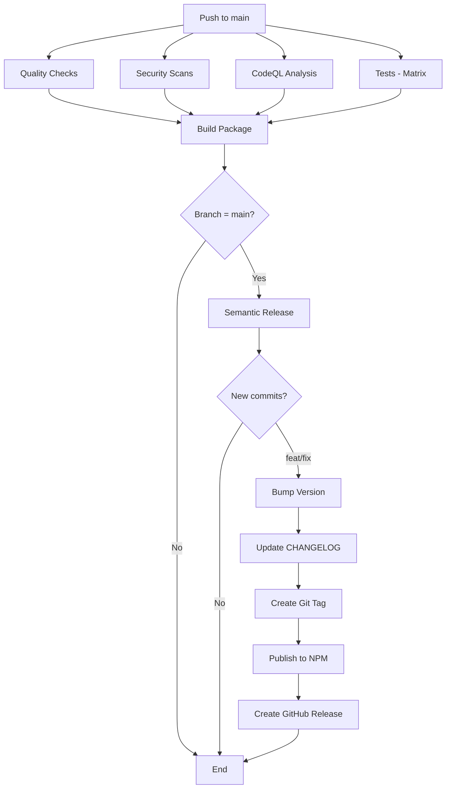
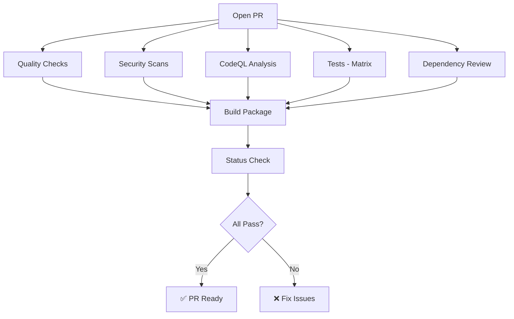

# GitHub Actions CI/CD Setup - Complete ✅

## 🎯 Overview

All GitHub Actions workflows have been rebuilt and optimized for the Numsy project. The setup now includes comprehensive CI/CD, security scanning, code quality checks, test coverage, and automated NPM publishing.

---

## ✅ What Was Fixed/Updated

### 1. **main.yml** - Primary CI/CD Pipeline

**Status:** ✅ Updated and Optimized

**Changes:**

- ✅ Updated all GitHub Actions to latest versions (v3 → v4)
- ✅ Updated CodeQL analysis with enhanced security queries
- ✅ Replaced `pnpm audit` with `pnpm run audit:check` script
- ✅ Added `pnpm run validate` command to quality checks
- ✅ Updated artifact upload with unique naming using `${{ github.sha }}`
- ✅ Enhanced semantic-release error handling for NPM cooldown
- ✅ Improved release summary with detailed output
- ✅ Added comprehensive status checking

**Jobs:**

1. **quality** - Lint, format, type-check, validation
2. **security** - pnpm audit, Snyk scans
3. **codeql** - GitHub CodeQL security analysis
4. **test** - Unit + E2E tests on multiple OS/Node versions
5. **build** - Build and package artifacts
6. **dependency-review** - Review dependencies on PRs
7. **release** - Semantic release and NPM publishing
8. **status** - Overall CI status check

---

### 2. **publish.yml** - Manual NPM Publishing

**Status:** ✅ Updated

**Changes:**

- ✅ Updated Node.js version from 18 → 20
- ✅ Replaced `pnpm run lint` with `pnpm run validate`
- ✅ Added comprehensive validation before publishing
- ✅ Enhanced release summary output

**Use Case:** Direct publishing without semantic-release

---

### 3. **security.yml** - Security Monitoring

**Status:** ✅ Updated

**Changes:**

- ✅ Updated CodeQL actions from v2 → v3
- ✅ Changed language config to `javascript-typescript`
- ✅ Added extended security queries
- ✅ Replaced direct `pnpm audit` with `pnpm run audit:check`
- ✅ Fixed automatic issue creation on vulnerabilities

**Triggers:**

- Push to main/develop/release branches
- Daily scheduled scan at 00:00 UTC
- Manual dispatch

---

### 4. **npm-publish.yml** - Legacy Workflow

**Status:** ✅ Deprecated but Fixed

**Changes:**

- ✅ Marked as deprecated and legacy
- ✅ Updated to use pnpm instead of npm
- ✅ Changed to workflow_dispatch only (requires manual "YES" input)
- ✅ Added warning that main.yml should be used instead

---

### 5. **ci.yml** - Legacy Workflow

**Status:** ✅ Already Correct (No changes needed)

**Note:** File is properly configured but marked as legacy. Use main.yml instead.

---

### 6. **release.yml** - Legacy Workflow

**Status:** ✅ Already Correct (No changes needed)

**Note:** Kept for reference. Use semantic-release in main.yml instead.

---

### 7. **semantic-release.yml** - Legacy Workflow

**Status:** ✅ Already Correct (No changes needed)

**Note:** Integrated into main.yml. This standalone version kept for reference only.

---

## 📋 Required GitHub Secrets

Add these secrets in **Settings → Secrets and variables → Actions:**

| Secret Name     | Required For               | How to Get                                                                                    |
| --------------- | -------------------------- | --------------------------------------------------------------------------------------------- |
| `NPM_TOKEN`     | Publishing to NPM          | [npmjs.com](https://www.npmjs.com) → Account Settings → Access Tokens → Generate (Automation) |
| `CODECOV_TOKEN` | Code coverage reporting    | [codecov.io](https://codecov.io) → Add repository → Copy token                                |
| `SNYK_TOKEN`    | Security scanning          | [snyk.io](https://snyk.io) → Settings → Auth Token                                            |
| `GITHUB_TOKEN`  | GitHub API (auto-provided) | Automatically available in workflows                                                          |

---

## 🔄 Workflow Execution Flow

### On Push to Main Branch:



### On Pull Request:



---

## 🧪 Testing Matrix

The test suite runs on multiple environments:

| OS             | Node Version | Tests                 |
| -------------- | ------------ | --------------------- |
| Ubuntu Latest  | 18           | Unit + E2E            |
| Ubuntu Latest  | 20           | Unit + E2E + Coverage |
| Windows Latest | 18           | Unit + E2E            |
| Windows Latest | 20           | Unit + E2E            |

**Total:** 4 parallel test jobs per run

---

## 📊 Code Coverage

- **Provider:** Codecov
- **Upload:** Automatic on Ubuntu + Node 20
- **Reports:** `coverage/lcov.info`, `coverage/lcov-report/`
- **Dashboard:** `https://codecov.io/gh/shreesharma07/numsy`

**Local Coverage:**

```bash
pnpm test:cov
open coverage/lcov-report/index.html
```

---

## 🚀 Release Process (Automated)

### Semantic Version Bumping:

| Commit Type                    | Version Bump          | Example                         |
| ------------------------------ | --------------------- | ------------------------------- |
| `fix:`                         | Patch (1.0.0 → 1.0.1) | `fix: correct validation logic` |
| `feat:`                        | Minor (1.0.0 → 1.1.0) | `feat: add new export format`   |
| `feat!:` or `BREAKING CHANGE:` | Major (1.0.0 → 2.0.0) | `feat!: change API structure`   |
| `docs:`, `chore:`, `style:`    | No release            | -                               |

### What Happens on Release:

1. ✅ Analyzes commit messages since last release
2. ✅ Determines new version number
3. ✅ Updates `package.json` version
4. ✅ Generates/updates `CHANGELOG.md`
5. ✅ Creates Git tag (e.g., `v1.0.3`)
6. ✅ Publishes to NPM with public access
7. ✅ Creates GitHub release with notes
8. ✅ Commits changes back to repository

---

## 🛡️ Security Scanning

### Daily Scans (00:00 UTC):

- **Snyk:** Dependency vulnerabilities, code security
- **CodeQL:** Source code analysis, security patterns
- **pnpm audit:** NPM package vulnerabilities

### On Every Push:

- All security scans run
- Results uploaded to GitHub Security tab
- Issues auto-created for high-severity vulnerabilities

### Viewing Results:

- GitHub → Security → Code scanning alerts
- GitHub → Security → Dependabot alerts
- Snyk dashboard

---

## 📦 Package Distribution

### NPM Package Details:

- **Package Name:** `@numsy/numsy`
- **Registry:** npmjs.com
- **Access:** Public
- **Current Version:** 1.0.2

### Published Files:

```
@numsy/numsy/
├── dist/           # Compiled JavaScript & TypeScript definitions
├── public/         # Static assets
├── README.md       # Documentation
└── LICENSE         # MIT License
```

### Installation:

```bash
npm install @numsy/numsy
# or
pnpm add @numsy/numsy
# or
yarn add @numsy/numsy
```

---

## 🔧 Local Development Workflow

### Before Committing:

```bash
# Run all validations
pnpm run validate

# Or run individually
pnpm run lint:check
pnpm run format:check
pnpm run type-check
pnpm test
```

### Before Pushing:

```bash
# Build to ensure it compiles
pnpm run build

# Run full test suite with coverage
pnpm test:cov
```

### Commit Message Format:

```bash
# Feature
git commit -m "feat: add support for custom validators"

# Bug fix
git commit -m "fix: resolve CSV parsing issue with special characters"

# Breaking change
git commit -m "feat!: change API to async/await pattern

BREAKING CHANGE: All methods now return promises"

# Non-release commits
git commit -m "docs: update API documentation [skip ci]"
git commit -m "chore: update dependencies"
```

---

## 📝 Available Scripts (from package.json)

### Build & Development:

```bash
pnpm run build          # Full production build
pnpm run dev            # Start development server
pnpm run serve          # Start CLI server (dev)
pnpm run serve:prod     # Start CLI server (production)
```

### Testing:

```bash
pnpm test               # Run unit tests
pnpm test:watch         # Run tests in watch mode
pnpm test:cov           # Tests with coverage report
pnpm test:e2e           # End-to-end tests
pnpm test:debug         # Tests in debug mode
```

### Code Quality:

```bash
pnpm run lint           # Lint and auto-fix
pnpm run lint:check     # Lint without fixing
pnpm run format         # Format code
pnpm run format:check   # Check formatting
pnpm run type-check     # TypeScript type checking
pnpm run validate       # Lint + type-check + tests
```

### Security:

```bash
pnpm run audit:check    # Security audit (moderate+ severity)
pnpm run audit:fix      # Fix security issues
pnpm run security:check # Full security check (audit + snyk)
```

### Release:

```bash
pnpm run release        # Semantic release (CI only)
pnpm run release:dry    # Dry run of release
pnpm run release:preview # Preview next release version
```

---

## 🐛 Troubleshooting

### Workflow Not Triggering?

- ✅ Check branch matches trigger conditions
- ✅ Ensure no `[skip ci]` in commit message
- ✅ Verify workflow file syntax (YAML validation)
- ✅ Check GitHub Actions settings are enabled

### NPM Publish Failing?

- ✅ Verify `NPM_TOKEN` secret is set correctly
- ✅ Check for 24-hour cooldown error (see workflow logs)
- ✅ Ensure package name is not already taken
- ✅ Verify npm account has publish permissions

### Tests Failing in CI but Passing Locally?

- ✅ Check OS-specific issues (Windows vs Ubuntu)
- ✅ Verify all test files are committed
- ✅ Ensure test data files exist in repository
- ✅ Check for timezone or locale differences

### Security Scans Failing?

- ✅ Security scans use `continue-on-error: true`
- ✅ They won't block the pipeline
- ✅ Review warnings and fix when possible
- ✅ Update dependencies: `pnpm update`

---

## 📈 Monitoring & Dashboards

### GitHub Actions:

- **URL:** `https://github.com/shreesharma07/numsy/actions`
- **View:** All workflow runs, logs, artifacts

### Codecov:

- **URL:** `https://codecov.io/gh/shreesharma07/numsy`
- **View:** Coverage trends, file coverage, pull impact

### NPM Package:

- **URL:** `https://npmjs.com/package/@numsy/numsy`
- **View:** Downloads, versions, readme

### Snyk:

- **URL:** `https://snyk.io/org/YOUR_ORG`
- **View:** Vulnerabilities, fix PRs, security scores

---

## ✅ Checklist for New Features

- [ ] Write tests for new functionality
- [ ] Run `pnpm run validate` locally
- [ ] Use conventional commit messages
- [ ] Update documentation if needed
- [ ] Check test coverage remains high
- [ ] Review security scan results
- [ ] Verify build succeeds locally

---

## 📚 Additional Resources

- [Workflow README](.github/workflows/README.md) - Detailed workflow documentation
- [Conventional Commits](https://www.conventionalcommits.org/)
- [Semantic Release Docs](https://semantic-release.gitbook.io/)
- [GitHub Actions Docs](https://docs.github.com/en/actions)
- [pnpm Documentation](https://pnpm.io/)

---

## 🎉 Summary

Your CI/CD pipeline is now fully configured and optimized!

**Key Features:**

- ✅ Automated testing on multiple platforms
- ✅ Comprehensive security scanning
- ✅ Code coverage tracking
- ✅ Automated versioning and publishing
- ✅ Quality gates and validation
- ✅ Scheduled security monitoring
- ✅ Detailed workflow documentation

**Next Steps:**

1. Add required secrets to GitHub repository
2. Push to main branch to trigger first workflow run
3. Monitor the Actions tab for results
4. Review and configure Codecov/Snyk dashboards

---

**Setup Date:** March 9, 2026  
**Status:** ✅ Complete and Operational  
**Maintained by:** Numsy Team
