# 📦 Semantic Release Integration - Complete Setup

## ✅ What's Been Implemented

### 🔄 Automated Release Management

**Semantic Release** has been fully integrated into Numsy for automated:

- Version bumping (major, minor, patch)
- CHANGELOG generation
- Git tagging
- NPM publishing
- GitHub releases
- Issue/PR commenting

---

## 📁 Files Created

### Configuration Files

1. **`.releaserc.json`** - Main semantic-release configuration
   - Defines release branches (main, develop, release/\*)
   - Configures plugins for analysis, changelog, npm, git, github
   - Sets up custom release rules
   - Configures emoji-based changelog sections

2. **`.github/workflows/semantic-release.yml`** - Automated release workflow
   - Triggers on push to main, develop, release/\* branches
   - Runs tests before release
   - Executes semantic-release
   - Publishes to NPM automatically

3. **`docs/RELEASE_GUIDE.md`** - Comprehensive release documentation
   - How semantic-release works
   - Conventional commit examples
   - Version bumping rules
   - Troubleshooting guide
   - Best practices

### Updated Files

1. **`package.json`**
   - Added semantic-release scripts
   - Added all required dependencies
   - `release`: Run semantic-release
   - `release:dry`: Test release without publishing
   - `release:local`: Run locally without CI

2. **`CHANGELOG.md`**
   - Reformatted for semantic-release compatibility
   - Added conventional commits format header
   - Organized by feature categories with emojis

3. **`.github/workflows/release.yml`**
   - Renamed to "Manual Release (Legacy)"
   - Kept for backward compatibility
   - Added workflow_dispatch for manual triggers

---

## 🚀 How It Works

### Automatic Release Process

```mermaid
graph LR
    A[Commit to main] --> B[CI Tests Run]
    B --> C[Semantic Release Starts]
    C --> D[Analyze Commits]
    D --> E[Determine Version]
    E --> F[Generate CHANGELOG]
    F --> G[Update package.json]
    G --> H[Create Git Tag]
    H --> I[Publish to NPM]
    I --> J[Create GitHub Release]
    J --> K[Comment on Issues/PRs]
```



### Branch-Based Releases

| Branch      | Release Type | NPM Tag   | Example         |
| ----------- | ------------ | --------- | --------------- |
| `main`      | Production   | `@latest` | `v1.2.3`        |
| `develop`   | Beta         | `@beta`   | `v1.3.0-beta.1` |
| `release/*` | RC           | `@rc`     | `v1.3.0-rc.1`   |

---

## 💬 Conventional Commits Required

### Commit Format

```
<type>(<scope>): <subject>

[optional body]

[optional footer]
```

### Version Impact

| Commit Type                        | Version Bump      | Example                 |
| ---------------------------------- | ----------------- | ----------------------- |
| `feat:`                            | **MINOR** (1.x.0) | `feat: add batch API`   |
| `fix:`                             | **PATCH** (1.0.x) | `fix: memory leak`      |
| `perf:`                            | **PATCH**         | `perf: optimize parser` |
| `feat!:` or `BREAKING CHANGE:`     | **MAJOR** (x.0.0) | `feat!: new API`        |
| `docs:`, `refactor:`, `build:`     | **PATCH**         | `docs: update guide`    |
| `style:`, `test:`, `ci:`, `chore:` | **NO RELEASE**    | `test: add tests`       |

### Examples

#### Feature (Minor Release)

```bash
git commit -m "feat: add WhatsApp number validation

- Support WhatsApp format detection
- Add test cases for WhatsApp numbers
- Update documentation"

# Result: 1.2.3 → 1.3.0
```

#### Bug Fix (Patch Release)

```bash
git commit -m "fix: resolve CSV parsing error

Fixed an issue where empty rows caused parsing to fail.
Now properly handles empty rows by skipping them."

# Result: 1.2.3 → 1.2.4
```

#### Breaking Change (Major Release)

```bash
git commit -m "feat!: change API response format

BREAKING CHANGE: The API now returns phone numbers in a new structure.
Migration guide available in docs/MIGRATION.md"

# Result: 1.2.3 → 2.0.0
```

---

## 📋 Usage Guide

### Production Release

```bash
# 1. Create feature branch
git checkout -b feature/my-feature

# 2. Make changes and commit
git add .
git commit -m "feat: add my feature"

# 3. Push and create PR to develop
git push origin feature/my-feature
gh pr create --base develop

# 4. After tests pass, merge to develop
# 5. When ready for production, create PR: develop → main
# 6. After merge to main:
#    - semantic-release analyzes commits
#    - Bumps version automatically
#    - Generates CHANGELOG
#    - Publishes to NPM @latest
#    - Creates GitHub release
```

### Beta Release (Testing)

```bash
# Merge to develop branch
git checkout develop
git merge feature/my-feature
git push origin develop

# Automatically creates:
# - Version: 1.3.0-beta.1
# - NPM tag: @beta
# - No GitHub release
```

### Test Release Locally

```bash
# See what would be released
pnpm run release:dry

# Output shows:
# - Next version
# - Generated changelog
# - Which files would be updated
```

---

## 🔧 Configuration Details

### Release Rules (.releaserc.json)

```json
{
  "branches": ["main", "develop", "release/*"],
  "plugins": [
    "@semantic-release/commit-analyzer", // Analyzes commits
    "@semantic-release/release-notes-generator", // Generates notes
    "@semantic-release/changelog", // Updates CHANGELOG.md
    "@semantic-release/npm", // Publishes to NPM
    "@semantic-release/git", // Commits & tags
    "@semantic-release/github" // Creates GitHub release
  ]
}
```

### GitHub Actions Workflow

**Trigger**: Push to `main`, `develop`, `release/*`

**Steps**:

1. ✅ Checkout code
2. ✅ Setup Node.js 20 + pnpm
3. ✅ Install dependencies
4. ✅ Run tests (must pass)
5. ✅ Build package
6. ✅ Run semantic-release
7. ✅ Publish results

**Required Secrets**:

- `GITHUB_TOKEN` (automatic)
- `NPM_TOKEN` (manual setup required)

---

## 🔐 Required Secrets

### NPM Token

```bash
# 1. Login to npm
npm login

# 2. Create access token
npm token create

# 3. Add to GitHub
# Go to: Settings → Secrets → Actions
# Name: NPM_TOKEN
# Value: [paste token]
```

### GitHub Token

Automatically provided by GitHub Actions with permissions:

- `contents: write` - For creating tags
- `issues: write` - For commenting on issues
- `pull-requests: write` - For commenting on PRs

---

## 📊 CHANGELOG Format

Semantic-release generates organized changelogs with emojis:

```markdown
## [1.3.0] - 2026-03-07

### ✨ Features

- feat: add batch processing API
- feat(parser): support Excel 2007+ format

### 🐛 Bug Fixes

- fix: resolve memory leak in validator
- fix(csv): handle empty rows correctly

### ⚡ Performance Improvements

- perf: optimize phone number regex

### 📚 Documentation

- docs: update API examples
- docs: add migration guide
```

---

## 🎯 Benefits

### Before Semantic Release

```bash
# Manual process:
1. Update version in package.json
2. Write CHANGELOG entry manually
3. Create git tag
4. Push tag
5. Create GitHub release manually
6. Publish to NPM manually
7. Update related issues/PRs

# Problems:
- Human error prone
- Time consuming
- Inconsistent versioning
- Missing changelog entries
- Forgot to update somewhere
```

### After Semantic Release

```bash
# Automated process:
1. git commit -m "feat: new feature"
2. git push origin main

# Everything else happens automatically:
✅ Version determined from commits
✅ CHANGELOG generated
✅ Git tag created
✅ GitHub release created
✅ Published to NPM
✅ Issues/PRs commented
✅ Consistent and accurate
```

---

## 🧪 Testing the Setup

### Dry Run

```bash
# Test locally without publishing
pnpm run release:dry

# Expected output:
[semantic-release]: The next release version is 1.2.4
[semantic-release]: Release note for version 1.2.4:
...changelog preview...
```

### First Real Release

```bash
# 1. Make a fix
git commit -m "fix: update README"

# 2. Push to main
git push origin main

# 3. Watch GitHub Actions
# - Go to Actions tab
# - See semantic-release workflow running
# - Check logs for release details

# 4. Verify release
npm view numsy version  # Should show new version
git tag -l             # Should show new tag
gh release list        # Should show new release
```

---

## 📚 Scripts Added

```json
{
  "release": "semantic-release",
  "release:dry": "semantic-release --dry-run",
  "release:local": "semantic-release --no-ci"
}
```

### Usage

```bash
# Normal release (in CI)
pnpm run release

# Test what would be released
pnpm run release:dry

# Release locally (not recommended for production)
pnpm run release:local
```

---

## ⚠️ Important Notes

### DO NOT Manually

- ❌ Update version in package.json
- ❌ Edit CHANGELOG.md for new versions
- ❌ Create version tags manually
- ❌ Publish to NPM directly

### DO Use

- ✅ Conventional commit messages
- ✅ Git Flow branching strategy
- ✅ Pull requests for code review
- ✅ Let semantic-release handle releases

### Commit Message Guidelines

```bash
# ✅ GOOD
feat: add new feature
fix: resolve bug
docs: update guide
perf: optimize code

# ❌ BAD
Added new feature
Bug fix
Update docs
Optimization
```

---

## 🐛 Troubleshooting

### No Release Created

**Check**:

1. Commits follow conventional format?
2. Any releasable commits? (feat, fix, perf, docs, refactor, build)
3. Message contains `[skip ci]`?
4. Correct branch (main, develop, release/\*)?

### NPM Publish Failed

**Check**:

1. NPM_TOKEN secret is set?
2. Token has publish permissions?
3. Package name available?
4. Not republishing same version?

### Git Push Failed

**Check**:

1. GITHUB_TOKEN has write permissions?
2. Branch protection allows bot?
3. Git credentials configured?

---

## 📖 Additional Resources

- **Release Guide**: [docs/RELEASE_GUIDE.md](./RELEASE_GUIDE.md)
- **Git Flow**: [docs/GIT_FLOW.md](./GIT_FLOW.md)
- **Setup Guide**: [docs/SETUP_GUIDE.md](./SETUP_GUIDE.md)
- **Semantic Release Docs**: <https://semantic-release.gitbook.io/>
- **Conventional Commits**: <https://conventionalcommits.org/>

---

## ✅ Setup Checklist

- [x] Install semantic-release and plugins
- [x] Create `.releaserc.json` configuration
- [x] Add GitHub Actions workflow
- [x] Update package.json scripts
- [x] Format CHANGELOG.md
- [x] Create release documentation
- [ ] **Add NPM_TOKEN to GitHub secrets** ← YOU NEED TO DO THIS
- [ ] **Enable branch protection on main** ← YOU NEED TO DO THIS
- [ ] **Test with dry run**
- [ ] **Make first automated release**

---

## 🎉 Summary

Semantic release is now fully integrated! Your workflow is:

1. **Commit with conventional format**: `feat:`, `fix:`, etc.
2. **Push to protected branch**: main, develop, or release/\*
3. **Watch automation happen**: Version, CHANGELOG, tag, publish, release

**Everything is automated. Just focus on writing good code and commit messages!**

---

**Last Updated**: March 6, 2026  
**Version**: 1.0.0  
**Status**: ✅ Ready for Production
